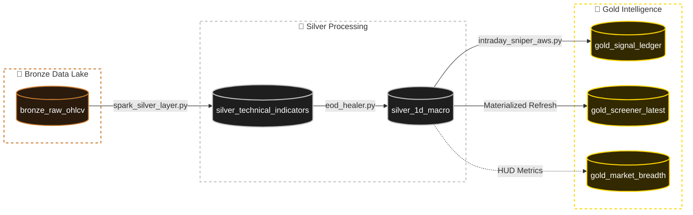

# ⚖️ The Market Oracle: Serverless Quantitative Data Pipeline

## 📌 Overview
The Market Oracle is an automated, serverless data engineering pipeline designed to ingest, transform, and serve institutional-grade stock market indicators. 

Rather than relying on real-time noise, this system operates on an **End-of-Day (EOD) Batch Processing** model. It leverages distributed computing (PySpark) to calculate multi-timeframe momentum and volume indicators (MACD, StochRSI, RSI, NVI) and serves them via a highly optimized Streamlit command center.

The architecture strictly adheres to the **Medallion Data Lakehouse Design Pattern** (Bronze -> Silver -> Gold).

---

## 🗄️ Institutional Data Schema

The Market Oracle utilizes a strict Medallion Architecture (Bronze ➔ Silver ➔ Gold). The data lineage is strictly typed and routed, ensuring absolute clarity from extraction to execution.

> **Visual Lineage:** The diagram below tracks the exact flow of the `ticker` key across the computational layers. *(If the animation is frozen, download `/docs/oracle_schema.html` and open it in your browser).*
>
> 

## 🏗️ The Medallion Architecture

### 🥉 Bronze Layer (Raw Ingestion)
* **Function:** Ingests unformatted, raw OHLCV (Open, High, Low, Close, Volume) data.
* **Sources:** Automated Yahoo Finance API (Global/Macro) & Manual Zerodha CSVs (High-Fidelity Sandbox).
* **Storage:** Append-only PostgreSQL tables.

### 🥈 Silver Layer (The Math Engine)
* **Function:** The `spark_silver_layer.py` engine wakes up via GitHub Actions, pulls the Bronze data into memory, and runs parallelized technical indicator math. 
* **Transformations:** * Timezone normalization (UTC -> IST).
  * MACD (12, 26, 9) structural trend calculation.
  * Negative Volume Index (NVI) calculation utilizing EMA(255) to detect institutional footprint.
  * Stochastic RSI micro-reversion tracking.

### 🥇 Gold Layer (Serving & Scoreboard)
* **Function:** Business-level aggregations designed specifically for fast UI querying.
* **Views:** * `gold_screener_latest`: The live radar of aligned momentum.
  * `gold_market_breadth`: Pre-calculated percentage of total market health.
  * `gold_signal_ledger`: An automated T+1 forward-testing database.

---

## 🧠 Core Engineering Challenges Solved

To build a resilient, production-ready system, several critical cloud infrastructure and data engineering hurdles were engineered out of the pipeline:

### 1. The Cloud Egress Tourniquet (State Management)
* **The Problem:** The Streamlit UI execution loop was triggering full database reads on every user interaction (keystrokes, tab clicks), resulting in a massive 4.7 GB/month data hemorrhage from Neon DB.
* **The Solution:** Implemented localized SQLAlchemy engines wrapped in strict `@st.cache_data(ttl=900)` decorators. This decoupled the UI render loop from the database I/O, reducing monthly network egress to a stable ~500 MB baseline while keeping the dashboard hyper-responsive.

### 2. The Forward-Testing Ledger (T+1 Settlement)
* **The Problem:** Most retail screeners suffer from survivorship bias, showing current signals without grading past performance.
* **The Solution:** Built a completely automated feedback loop. When the PySpark engine finds an "Elite Bull", it inserts it into the `gold_signal_ledger` as `PENDING`. On the next market day, the pipeline queries the new closing price, calculates the exact PnL percentage, and permanently settles the record as a `WIN` or `LOSS`. The dashboard natively reads this ledger to display the system's **True Mathematical Win Rate**.

### 3. Timezone Drift & Rangebreak Folding
* **The Problem:** Automated cloud runners (GitHub Actions) default to UTC, causing timestamp drift against the Indian Standard Time (IST) market hours. This resulted in broken candlestick charts with massive gaps during off-hours and weekends.
* **The Solution:** Engineered a precise timezone translation layer in Pandas/Plotly (`dt.tz_localize('UTC').dt.tz_convert('Asia/Kolkata')`). Implemented Plotly `rangebreaks` specifically tuned to the NSE market hours (folding time between 15:30 and 09:15) to render seamless institutional charts.

### 4. The Circuit Breaker Pattern (Data Quality Control)
* **The Problem:** Free API endpoints (Yahoo Finance) occasionally return inverted or corrupted intraday volume data, poisoning the Negative Volume Index (NVI) math.
* **The Solution:** Built a manual override "Circuit Breaker". Decoupled the corrupted automated data feed and isolated the pipeline to a "Manual Purist Sandbox" using high-fidelity Zerodha CSVs. This protected the downstream Gold Layer from ingesting false signals while maintaining the structural integrity of the PySpark processing engine.

---

## 🚀 Pipeline Orchestration

The entire compute layer is serverless, orchestrated by **GitHub Actions Ubuntu Runners**.

1. **`seed_bronze_zerodha.yml`**: Manual trigger (`workflow_dispatch`). Used to securely inject highly accurate, end-of-day broker data into the Bronze vault.
2. **`spark_silver_layer.yml`**: Cron-scheduled trigger (`30 10 * * 1-5` -> 4:00 PM IST). Automatically spins up a Java/PySpark environment, executes the complex math, handles the T+1 ledger settlements, and shuts down, costing $0 in idle compute.

---

## 🛠️ Tech Stack
* **Compute:** Apache PySpark (3.5.1), Pandas, NumPy
* **Database:** Neon DB (Serverless PostgreSQL), SQLAlchemy, psycopg2
* **Orchestration:** GitHub Actions CI/CD (YAML)
* **Frontend:** Streamlit, Plotly Graph Objects
* **Infrastructure Design:** Medallion Architecture, Infrastructure as Code (IaC) diagramming

---

*Disclaimer: This architecture is an engineering showcase of quantitative data pipelines. It is not financial advice.*
