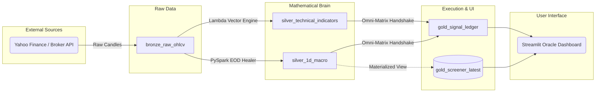
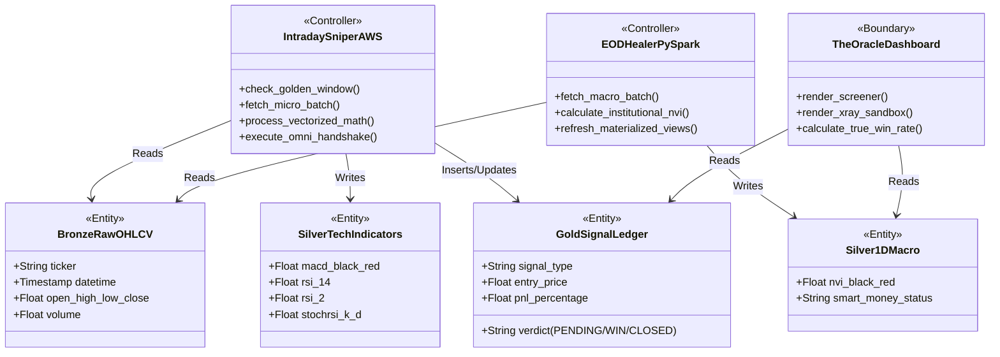
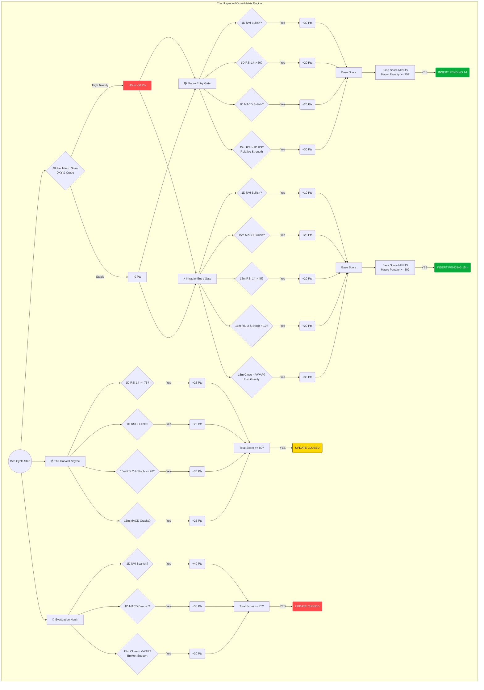

# ⚖️ The Omni-Matrix: System Architecture & Logic Rules

Welcome to the central nervous system of the Omni-Matrix Medallion Architecture. This document serves as the absolute source of truth for the algorithmic trading pipeline, detailing data lineage, object-oriented structures, and execution logic.

---

## 🏗️ 1. Medallion Data Lineage (The Flow)

Data enters raw, is refined through vectorized mathematics, and is ultimately forged into execution signals.

